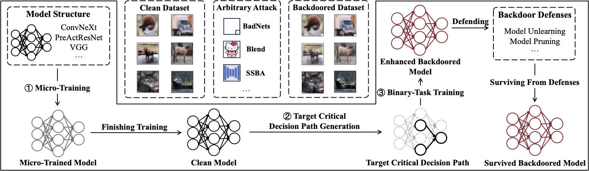

# Venom: A Generic Backdoor Attack Enhancer for Improving Survivability by Decision Path Coupling



Backdoor attacks have been one of the emerging security threats to deep neural networks (DNNs), leading to serious consequences. One of the mainstream backdoor defenses is model reconstruction-based. Such defenses adopt model unlearning or pruning to eliminate backdoors. However, little attention has been paid to survive from such defenses. To bridge the gap, we propose VENOM, the first generic backdoor attack enhancer to improve the survivability of the existing backdoor attacks against model reconstruction-based defenses. We formalize VENOM as a binary-task optimization problem. The first is the original backdoor attack task to preserve the original attack capability, while the second is the attack enhancement task to improve the attack survivability. To realize the second task, we propose attention imitation loss to force the decision path of poisoned samples in backdoored models to couple with the critical decision path of benign samples, which makes backdoors difficult to eliminate. Our extensive evaluation on three DNNs and four datasets has demonstrated that VENOM significantly improves the survivability of eight state-of-the-art attacks against ten state-of-the-art defenses without impacting the capability of the original attacks.

## Installation

You can run the following script to configurate necessary environment:

```shell
git clone https://github.com/VenomEnhancer/Venom.git
cd Venom
conda create -n venom python=3.8
conda activate venom
sh ./sh/install.sh
```

Note that for some attacks, they may need preprocessed datasets or pretrained models for training. For your ease, the datasets and models are provided in google drive. You can download label-consistent and ssba from [here](https://drive.google.com/drive/folders/1lnCObVBIUTSlLWIBQtfs_zi7W8yuvR-2?usp=share_link), and ada_blended from [here](https://drive.google.com/drive/folders/1927j981vXgTLSJM8NWJaGLvkrxIWPUHU?usp=sharing).

We also provide micro-trained model and generated TCDP in google drive, you can download them from [here](https://drive.google.com/drive/folders/1mSL64S07OQKw0VEzDDz6Bs2FzlG5Yf6C?usp=sharing). The downloaded files should be organized as follows：

```
Venom/
│
├── resource/
│   ├── ada_blended/
│   ├── badnet/
│   ├── blended/
│   ├── label-consistent/
│   ├── ssba/
│   └── trojannn/
│
├── similarity/
│   ├── results/
│   ├── calc_similarity.py
│   ├── CKA.py
│   └── sim.yaml
│
└── ...
```


## Quick Start

### Attack

Here we show how to obtain Venom-Enhanced backdoored models and Original backdoored models. Since we have provided micro-trained model and clean model, you can directly **skip** the ***TCDP Generation*** step and run the ***Training*** script.

#### TCDP Generation

This is an example for generating TCDP. First, training a clean model is needed. You can run the following script to train (/ micro-train)  a clean model. You will find details in `similarity/calc_similarity.py` .

```shell
python similarity/calc_similarity.py --mode train --save_path "results/cifar10/vgg19_bn" --model "vgg19_bn" --device "cuda:0" --dataset "cifar10"
```

Then you can obtain TCDP with the following script:

```shell
mkdir -p similarity/results/cifar10/vgg19_bn/similarity/
python similarity/calc_similarity.py --mode calc --save_path "results/cifar10/vgg19_bn" --model "vgg19_bn" --device "cuda:0" --dataset "cifar10"
```


#### Training

This is an example for training BadNets and Venom-BadNets.  Other hyperparameters follow default values in `attack/prototype.py`.

1. Original BadNets

   You can train original badnets on vgg19_bn using cifar10 with the following script, or you can specify the settings with `original_attack.sh`.

```shell
mkdir -p record/cifar10/vgg19_bn/original_attack/
python ./attack/badnet.py --is_couple "False" --model vgg19_bn --sim_mode clean --yaml_path ../config/attack/prototype/cifar10.yaml --save_folder_name "cifar10/vgg19_bn/original_attack/original_badnet" --device "cuda:0"
```


2. Venom-BadNets

   You can train venom-enhanced badnets on vgg19_bn using cifar10 with the following script, or you can specify the settings with `venom_attack.sh`.

```shell
mkdir -p record/cifar10/vgg19_bn/venom/single_deep_conv_10_beta_20_half_5
python ./attack/badnet.py --is_couple "True" --model vgg19_bn --sim_mode "single_deep_conv_10" --half_epochs 5 --sim_beta 20 --yaml_path ../config/attack/prototype/cifar10.yaml --save_folder_name "cifar10/vgg19_bn/venom/single_deep_conv_10_beta_20_half_5/venom_badnet" --device "cuda:0"
```


### Defense

This is a demo script of running NAD defense on original BadNets attack. Before defense you need to run Original BadNets attack on CIFAR10 at first. Then use the `save_folder_name` as `result_file`.

```python
python ./defense/nad.py --model "vgg19_bn" --result_file "cifar10/vgg19_bn/original_attack/original_badnet" --yaml_path ./config/defense/nad/cifar10.yaml --dataset "cifar10"  --device "cuda:0"
```

Similarly, you can run NAD defense on Venom-BadNets attack with the following script.
```python
python ./defense/nad.py --model "vgg19_bn" --result_file "cifar10/vgg19_bn/venom/single_deep_conv_10_beta_20_half_5/venom_badnet" --yaml_path ./config/defense/nad/cifar10.yaml --dataset "cifar10"  --device "cuda:0"
```

You can also specify the settings with `defense.sh`.


## Results

The experimental results in the paper can be found [here](https://docs.google.com/spreadsheets/d/1liGNtCqeaHOI2LR7TDcgzCRzqYJbsKhpoaAoPGwjqpk/edit?usp=sharing). You can refer to `utils/ASuR.py` to calculate the metric ASuR.


## Notation

Our implementation is based on [BackdoorBench](https://github.com/SCLBD/BackdoorBench), and we refer readers to [BackdoorBench](https://github.com/SCLBD/BackdoorBench) for detailed instructions regarding the basic configuration.

